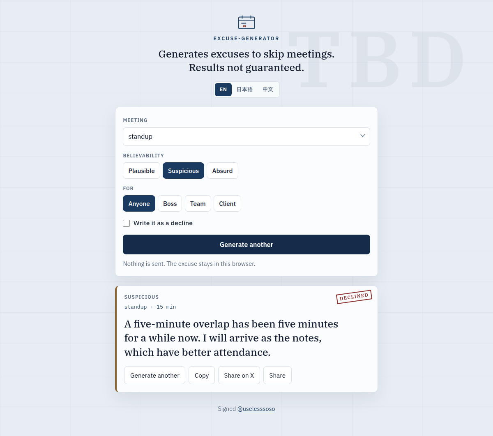

# excuse-generator

Generates excuses to skip meetings. Results not guaranteed.



A small page that writes an excuse for skipping a meeting. Pick the meeting, how believable it should be, and who it is for. Read it in English, Japanese, or Chinese. Copy it, or post a short version on X.

Nothing is stored and nothing is sent. The excuse is assembled in the browser.

Live: https://uselesssoso.github.io/excuse-generator/

The second of the useless things. The first is [fortune-japan](https://github.com/uselesssoso/fortune-japan).

## Run locally

Open `index.html`, or from this folder:

```bash
python3 -m http.server 4173
```

Then visit `http://localhost:4173`.

## Deploy to GitHub Pages

`.github/workflows/pages.yml` publishes the site on every push to `main`.

After merging, enable it once:

1. Open **Settings → Pages**.
2. Under **Build and deployment**, set **Source** to **GitHub Actions**.

The site will be at `https://uselesssoso.github.io/excuse-generator/`.

## License

[MIT](LICENSE) © uselesssoso

Signed [@uselesssoso](https://github.com/uselesssoso)
